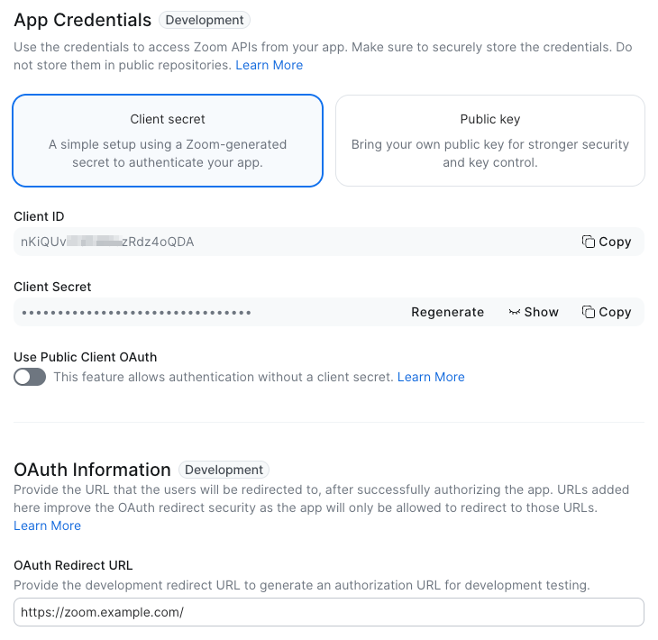
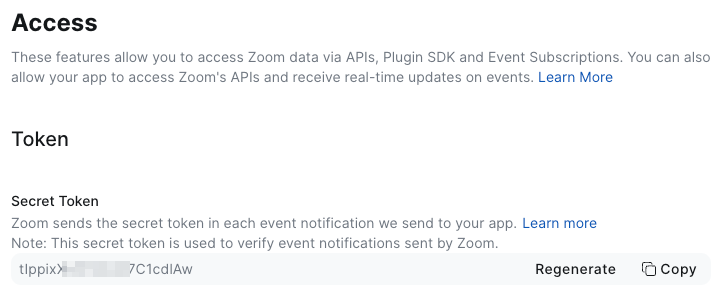
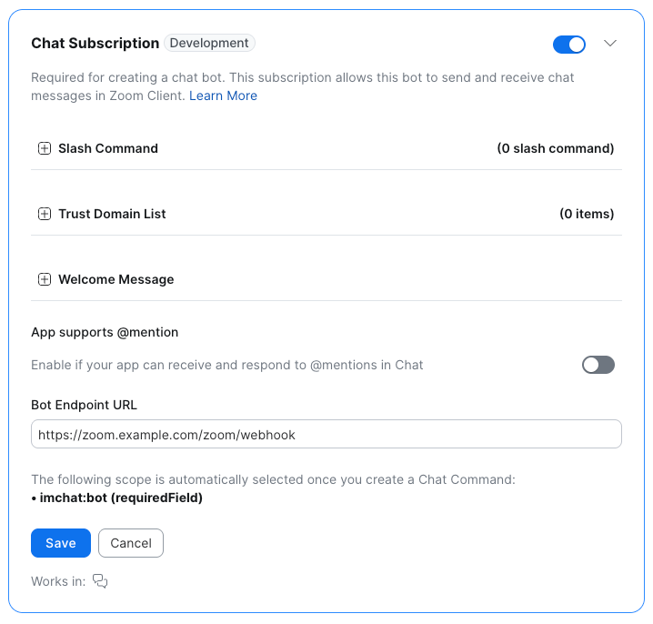
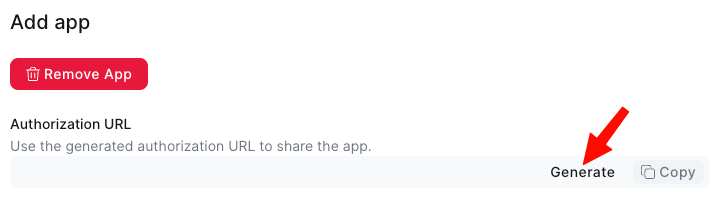

# Zoom Team Chat Setup

> Setup guide for the Zoom Team Chat platform plugin.
> [English](zoom-app-setup.md) · [简体中文](zoom-app-setup.zh-CN.md)

> 📌 **This guide walks through setup on macOS.** The steps are the same on
> Linux/Windows, but the service-management commands differ — consult the
> relevant upstream docs (Cloudflare, your init system) for those platforms.

> **A note on terminology.** This project is a Hermes **platform plugin** (a
> distribution/install unit with a `plugin.yaml`). Inside it lives an
> **adapter** (`ZoomAdapter`), which is the code that connects Hermes to Zoom.
> Throughout this guide we say "the plugin" when we mean the thing you install
> and enable, and "the adapter" only when referring to its internals. Zoom Team
> Chat itself is the **channel** the plugin adds to the Hermes messaging
> gateway.

This guide is organized **in the order you'll actually set things up**:

1. **Expose your webhook on the public internet.** Zoom delivers chat events to
   the plugin as HTTP webhooks (`POST /zoom/webhook`), so you first need a
   public HTTPS endpoint pointing at the plugin's local port. We use a
   **Cloudflare named tunnel** for this — no inbound firewall holes, automatic
   TLS, and it survives reboots once installed as a service.
2. **Register a Chatbot app on the Zoom Marketplace.** That app is what gives
   the plugin its **Client ID**, **Client Secret**, **Secret Token**, and
   **Bot JID** — the four credentials it needs to authenticate and reply.
3. **Install and enable the plugin in Hermes**, feeding it those credentials.

Each step depends on the one before it, so do them in order.

For the full list of configuration variables and features, see the
[README](../README.md).

---

## Step 1 — Expose the webhook with a Cloudflare named tunnel

Zoom delivers chatbot events by POSTing to a **public HTTPS URL** that you'll
register on the app's Team Chat Subscription (Step 2). The plugin itself only
listens on a local port (`8646` by default). A **Cloudflare named tunnel**
bridges the two — and once installed as a system service, it comes back on its
own after every reboot, so you never have to remember to start it by hand.

You'll need:

- A Cloudflare account with a domain managed by Cloudflare DNS.
- `cloudflared` installed
  ([install guide](https://developers.cloudflare.com/cloudflare-one/connections/connect-networks/get-started/create-remote-tunnel/#1-install-cloudflared));
  on macOS the easy route is `brew install cloudflared`.

### 1.1 Authenticate cloudflared

```bash
cloudflared tunnel login
```

A browser opens; pick the zone (domain) you want to use. This writes a
`cert.pem` to `~/.cloudflared/` — it's used only to create tunnels and DNS
routes, not to run them.

### 1.2 Create the tunnel

```bash
cloudflared tunnel create zoom-webhook
```

This prints a tunnel UUID and writes a credentials file to
`~/.cloudflared/<UUID>.json`. Keep this file — it's what authenticates the
running tunnel.

### 1.3 Route a hostname to the tunnel

```bash
cloudflared tunnel route dns zoom-webhook zoom.example.com
```

Replace `zoom.example.com` with your own hostname. This creates the `CNAME`
record pointing at `<UUID>.cfargotunnel.com` for you.

### 1.4 Configure ingress

Create `~/.cloudflared/config.yml`:

```yaml
tunnel: zoom-webhook
credentials-file: /Users/<you>/.cloudflared/<UUID>.json

ingress:
  - hostname: zoom.example.com
    service: http://localhost:8646
  - service: http_status:404
```

Notes:

- `8646` must match your `ZOOM_WEBHOOK_PORT` (the default is `8646`).
- The catch-all `http_status:404` rule is **required** as the last ingress
  entry.
- Zoom will POST to `https://zoom.example.com/zoom/webhook`. The plugin also
  exposes `GET /` (a small landing page) and `GET /health` for verification.

### 1.5 Run it as a launch agent (auto-start on login)

This is the step that makes the tunnel come back by itself after a restart —
no manual command needed each boot.

If you installed `cloudflared` via Homebrew:

```bash
brew services start cloudflared
```

Otherwise, install the launch agent directly (no `sudo` — runs as your user,
reads `~/.cloudflared/config.yml`, starts when you log in):

```bash
cloudflared service install
```

> To run at **boot** (before login), use `sudo cloudflared service install`
> instead, which installs a launch _daemon_. Note that a launch daemon runs as
> root, so you must make sure root can read your config — the simplest fix is
> to also place `config.yml` and the credentials JSON under `/etc/cloudflared/`.
> For a personal Mac that you log into, the login-agent form above is usually
> enough.

Verify the service is running:

```bash
brew services info cloudflared       # Homebrew install
launchctl list | grep cloudflared    # direct launch-agent install
```

### 1.6 Verify the tunnel

Wait a few seconds, then hit the plugin's landing page through the public URL:

```bash
curl https://zoom.example.com/health
# → ok
```

(Or just open `https://zoom.example.com/` in a browser — you should see the
landing page, which also confirms the tunnel + origin are wired up.)

If you get `ok`, the tunnel is routing traffic to the plugin. If the plugin
hasn't started yet, `cloudflared` will keep retrying `localhost:8646` and
connect automatically once it's up — there is **no strict startup-order
dependency** between the tunnel and Hermes.

➡️ **You now have your webhook URL:** `https://zoom.example.com/zoom/webhook`.
You'll paste it into the Zoom app in Step 2.

---

## Step 2 — Register a Chatbot app on the Zoom Marketplace

### 2.1 Create an app on the Zoom Marketplace

Visit <https://marketplace.zoom.us/> and sign in. Confirm you can see the
**Developer** entry in the bottom-left corner (requires the relevant
permission), then click it to reach <https://marketplace.zoom.us/user/build>.

Once there, click **Develop** → **Build app** in the top-right, and in the
*What kind of app are you creating* dialog choose **General App**.

Zoom assigns the app a default name — this is the name it shows as in Zoom
Team Chat. You can edit it via the pencil icon next to the app name at the top
of the screen.

### 2.2 Get the Client ID and Secret

The rest of the app settings follow; unless noted, you can leave everything at
its default.

On the **Basic Information** page you'll find the **Client ID** and
**Client Secret** — save these, you'll need them later. The **OAuth Redirect
URL** can be set to the root of your custom domain, e.g.
`https://zoom.example.com/` (the plugin's landing page).



### 2.3 Get the Secret Token

Under **Features → Access** you'll find the **Secret Token**.



### 2.4 Get the Bot JID

Under **Features → Surface**, select **Chat** under *Select where to use your
app*, then enable **Chat Subscription**. Enter your webhook URL from Step 1
(`https://zoom.example.com/zoom/webhook`) into **Bot Endpoint URL** and click
**Save**.



The **Home tab** and **Channel tab** checkboxes under *Chat tabs* below can be
left checked.

### 2.5 Get the Authorization URL

In the final **Local Test** step, click **Generate** under *Authorization URL*
to generate an Authorization URL. After completing Step 3, you'll use this URL
to install the app into your Zoom client.



---

## Step 3 — Install and enable the plugin in Hermes

With your four credentials and webhook URL in hand, wire the plugin into
Hermes. Full details are in the [README](../README.md); the essentials:

1. **Install the plugin** under the platforms directory
   (`~/.hermes/plugins/platforms/zoom`), or via
   `hermes plugins install porter-liu/hermes-zoom-team-chat`.

2. **Set the four required credentials.** They're read from environment
   variables (or `~/.hermes/.env`):

   ```bash
   export ZOOM_CLIENT_ID="..."
   export ZOOM_CLIENT_SECRET="..."
   export ZOOM_BOT_JID="xxx@xmpp.zoom.us"
   export ZOOM_SECRET_TOKEN="..."
   ```

3. **Enable the plugin and the channel** (user-installed platform plugins are
   opt-in):

   ```bash
   hermes plugins enable zoom-platform
   ```

   and in `~/.hermes/config.yaml`:

   ```yaml
   gateway:
     platforms:
       zoom:
         enabled: true
   ```

4. **Restart Hermes.**

5. **Install the app into your Zoom client.** Open the Authorization URL you
   generated in Step 2 in a browser and sign in with your Zoom account to
   complete the install.

6. **Complete DM pairing.** Send the bot a direct message in Zoom Team Chat;
   Hermes replies with a pairing code. Approve it from your terminal
   (substitute the code you received for `THE_PAIRING_CODE_YOU_GOT`):

   ```bash
   hermes pairing approve zoom THE_PAIRING_CODE_YOU_GOT
   ```

   Once paired, you can chat with Hermes over Zoom Team Chat.

> 💡 This DM also seeds the plugin's cached `account_id` (auto-captured —
> details in the README's "Account ID is auto-learned" note).

---

### Troubleshooting

> For credential-related issues (401s, `account_id` not captured) see the
> [README](../README.md#notes--troubleshooting).

- **`curl https://…​/health` times out or returns 502 / 503** — the tunnel is
  up but nothing is listening on `8646`. Check that Hermes is running and the
  Zoom plugin reports as connected.
- **Health endpoint works but Zoom webhooks never arrive** — re-check the Event
  notification URL in the Team Chat Subscription, and confirm that *Signature*
  is enabled there with `ZOOM_SECRET_TOKEN` matching the token in
  **Features → Access**.
- **Tunnel didn't survive a reboot** — confirm the launch agent is loaded:
  `brew services list` / `launchctl print gui/$(id -u)/com.cloudflare.cloudflared`.
  `brew services start cloudflared` or `cloudflared service install` is what
  flips auto-start on.
